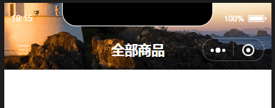
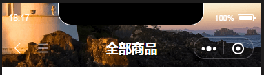
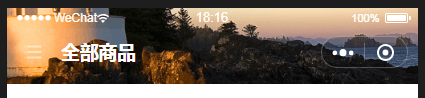
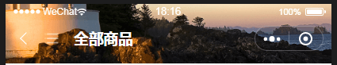

# wx-mini-navigationbar

小程序自定义标题栏组件，支持设置背景图片，以及背景图片的显示mode，允许在左侧添加一个按钮，适配了Android方便微信的标题靠左显示

## 使用效果







## 使用方法


**属性介绍**

|属性名      |类型      |默认值     |是否必须    |说明
|-----------|----------|----------|------------|------------------------------------------
|menuSrc    |String    |''        |否          |按钮图片地址
|bgImgSrc   |String    |''        |否          |背景图片地址
|bgImgMode  |String    |aspectFill|否          |背景图片的显示模式
|title      |String    |''        |否          |标题
|titleTextColor|String    |''        |否          |字体和按钮以及loading图标的颜色，按钮和loading暂时只有黑白2色
|backgroundColor|String    |''        |否          |整个标题栏的背景颜色
|loading      |Boolean    |false        |否          |是否是加载状态
|backProxy      |Boolean    |false        |否          |是否重写了返回键

标题栏中属性的默认数据会自动获取json配置以及系统的默认数据，如果不需要动态更改样式，可以在json中设置，组件中同样起作用


**事件介绍**

|属性名      |detail
|-----------|------------------------------------------
|NaviBack   |返回的逻辑方法
|MenuTap    |按钮的点击事件

```json
"usingComponents": {
    "toolBar": "/component/toolbar"
},
```

```xml
<toolBar menuSrc='/image/menu_white.png' bindMenuTap='onMenuTap' bgImgSrc='/image/navi-bg.jpg' />
```

**高度说明：**
为了方便适配，这里给出自定义标题栏的计算公式：
const MenuRect = wx.getMenuButtonBoundingClientRect()
const statusBarHeight = wx.getSystemInfoSync().statusBarHeight;
const height = (MenuRect.top - statusBarHeight) * 2 + MenuRect.height +MenuRect.top


